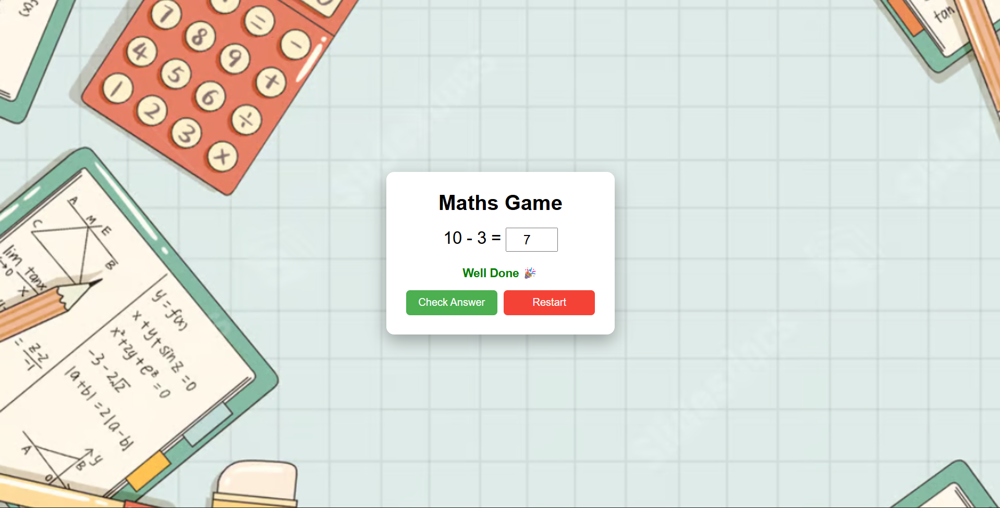

# Maths Quiz Game

An interactive maths game that generates random equations and checks user answers instantly.

## About

This is a browser-based maths quiz game built using HTML, CSS, and JavaScript.  
The game generates random math questions, lets users enter answers, and shows feedback like “Well Done” for correct answers and “Try Again” for wrong answers.  
I built this project to practice logic building, random question generation, and handling user input with JavaScript.

## Built With

`HTML` `CSS` `JavaScript`

## What I Learned

- How to generate random math problems and validate user answers using JavaScript while updating the UI dynamically.

## Links

- [Live Demo](https://snehashrestha123.github.io/Maths-Game/ )
- [Source Code](https://github.com/Snehashrestha123/Maths-Game)
